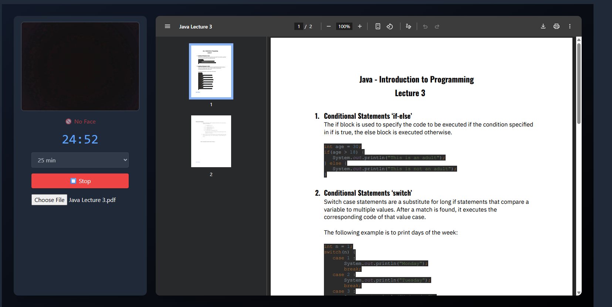
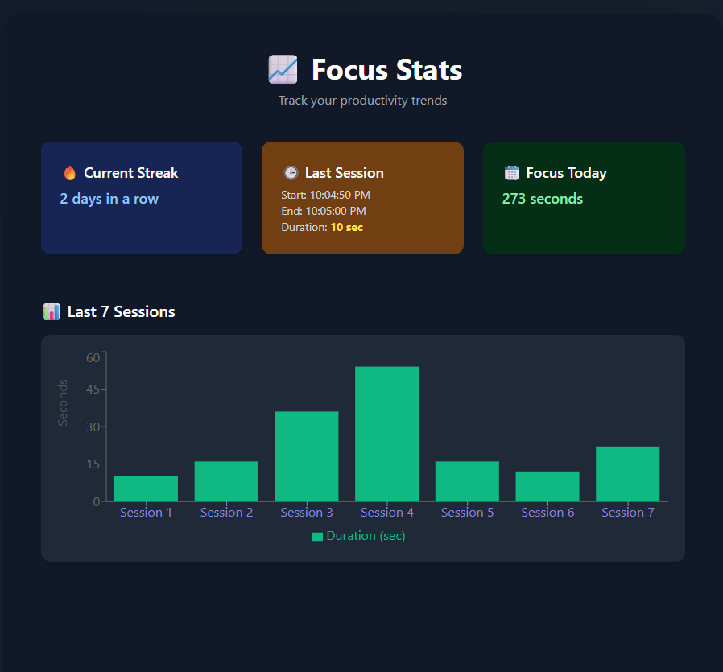
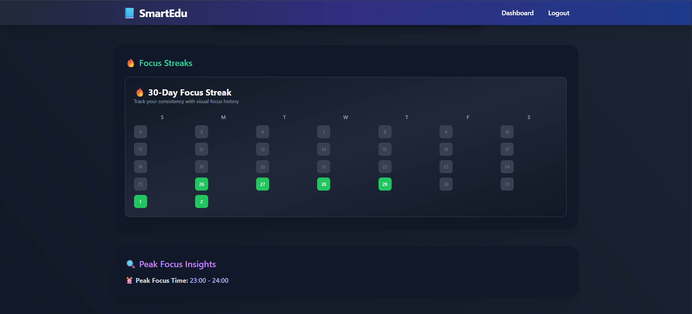

# 📘 FocusMate

**Smart focus and productivity tracker for learners**

SmartEdu is a full-stack MERN (MongoDB, Express, React, Node.js) application designed for students and self-learners to **maximize focus**, **minimize distractions**, and gain intelligent **productivity insights**. It combines AI, distraction tracking, journaling, and analytics in a modern, responsive interface.

---

## ✨ Features

### 🎯 Focus Mode  
Stay accountable while studying:
- Distraction detection via webcam using **MediaPipe FaceMesh**
- PDF viewer for studying notes/books inside the workspace
- Real-time alerts if you look away or get distracted
- Timer, distraction log, and PDF session summary export

### 🧠 AI-Powered Session Summaries  
Get natural language feedback after every session:
- Total focus time, distractions, productivity ratio
- Generated using **Cohere API** (no OpenAI token required)

### 📓 Journaling  
Reflect, track, and grow:
- Write daily study journals
- View past entries and AI summaries
- Helps build consistent learning habits

### 📊 Analytics  
Know your trends, streaks & distractions:
- Focus time charts (line, pie)
- Distraction breakdown
- Streak calendar (LeetCode-style)
- Peak productivity time insights

### 🧑‍💻 AI Assistant  
Study smarter with AI help:
- Chat-based support for Q&A, study help, productivity coaching

---

## 🧰 Tech Stack

| Category       | Technologies                                      |
|----------------|---------------------------------------------------|
| Frontend       | React, Tailwind CSS, Chart.js, jsPDF              |
| Backend        | Node.js, Express.js, MongoDB                      |
| AI/ML          | MediaPipe FaceMesh, Cohere API                    |
| File Parsing   | pdf-parse, mammoth (for PDF & DOCX)               |
| Extras         | Vite, React Router, Axios, dotenv, JWT Auth       |

---

## 🖼️ Screenshots






## 🛠️ Installation & Setup

```bash
# 1. Clone the repo
git clone https://github.com/yourusername/smartedu.git
cd smartedu

# 2. Install dependencies
npm install

# 3. Start the app
npm run dev  # For Vite projects

# 4. Create a .env file and add your keys

